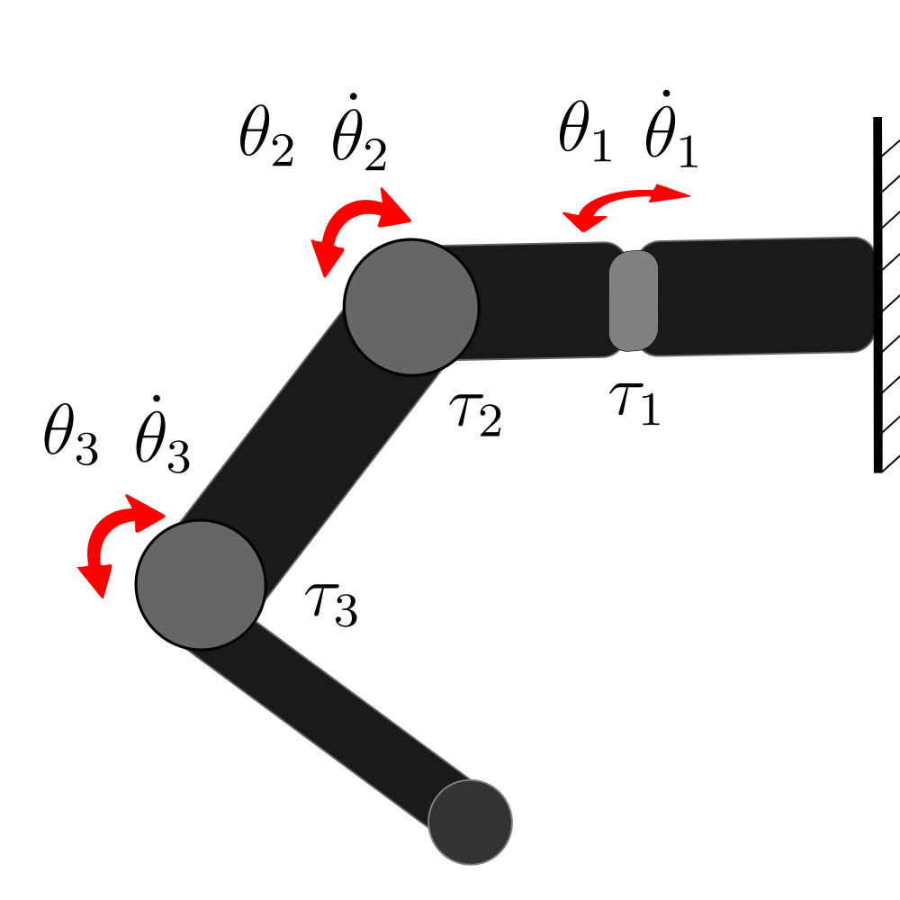

# AR_Transformer: Modeling Dynamical Systems with AutoRegressive Transformers

## Table of Contents
- [Overview](#overview)
- [Requirements](#requirements)
- [Project Structure](#project-structure)
- [Datasets](#datasets)
- [Usage](#usage)
- [Citation](#citation)
- [License](#license)
- [Contact](#contact)

## Overview

Many applications require accurate models of dynamical systems, such as realistic simulation, state prediction, and control. We present a transformer-based architecture, called AR-Transformer, designed to estimate the model of complex nonlinear systems. Our goal is to predict the behavior of the system knowing only its initial state at any time step for any prediction horizon, knowing the external inputs or the control inputs. 

The AR-Transformer has an autoregressive approach, which allows the architecture to iterate and estimate states up to the time step for which the control inputs are known. This autoregressive approach works correctly with large prediction horizons thanks to training the model without teacher forcing. 


This is a diagram of the AR-Transformer architecture. Consider the state of a system at time step $t$ as $y_t\in \mathbb{R}^{m}$ and the control inputs at $t$ as $u_t \in \mathbb{R}^{n}$. The encoder calculates the context from the last $h$ control inputs and estimated system states $X_{t-1,t-h}$. The decoder estimates the next state $\hat{y}_{t+1}$ of the system from the output of the encoder, and the current control inputs $u_t$ and state $\hat{y}_t$. The model can be used in autoregressive way to predict any prediction horizon knowing the control inputs.
 
## Requirements

This project has been realized with Python 3.6.8 and the following [libraries](requirements.txt):
- **TensorFlow** == 2.6.2
- **Keras** == 2.6.0
- **NumPy** == 1.19.5
- **Pandas** == 1.1.5
- **Matplotlib** == 3.0.3
- **scikit-learn** == 1.5.1

We tested the code with a NVIDIA GeForce GTX Titan XP using CUDA Toolkit 11.4

## Project Structure

Here is a list of the main files and directories included in the project, along with a brief description of what each one does:

- `ar_transformer.py`: Main Script for Training and Testing the AR_Transformer on Datasets of Dynamical Systems.
- `datasets/`: Directory that contains datasets and pre-trained models for each example.
    - `robot_arm/`: Directory for the robot_arm dataset.
        - `losses/`: Contains the loss values of the trained models.
        - `networks/`: Trained models.
        - `series/`: Robot_arm dataset.
    - ... Same structure for each dataset.
- `libs/`:
    - `config.py`: Configuration and hyperparameters of all the Datasets and Networks.
    - `data.py`:  Functions for Preprocessing Dynamical Systems Datasets.
    - `metrics.py`: Metrics and Loss Functions used during Training and Testing.
    - `network.py`: Class for Training and Testing the AR_Transformer on Datasets of Dynamical Systems.
    - `plot.py`: This file defines functions to plot the loss evolution during training with and without teacher forcing, calculate and print various performance metrics, and visualize the prediction results for the different datasets.
- `requirements.txt`: List of Python dependencies required to run the project.
- `README.md`: The readme file you are currently reading.
- `LICENSE`: The license file for the project.

## Datasets

This repository includes two configured datasets, with which you can train models or test pre-trained models. The datasets are public and can be found together with more information in the following links:
- [Robot_arm](https://github.com/rr-learning/transferable_dynamics_dataset)
- [Industrial_robot](https://www.nonlinearbenchmark.org/benchmarks/industrial-robot)

To visualize the format of the datasets compatible with this code, let's take robot_arm as an example. In [Robot_arm](https://github.com/rr-learning/transferable_dynamics_dataset), a dataset based on real experiments of a 3 DOF robotic arm system is presented, similar to the one shown in the figure below. The robot arm has three joints, each providing one degree of freedom. It is controlled by sending desired torque commands to the motors at each joint. The setup includes a variety of controllers to assess the transferability of learned dynamics models. In particular, we have used the dataset that employs feedback polices, which generates the control inputs with a PD controller. The dataset consists of 50 series of experiments, where each series consists of 14 seconds. The control and observation rate is 1000 Hz, meaning that from each series we have 14000 time steps. At each time step $t$, we have as control input $u_t$ the three desired torques (Nm) sent to the motors, where $n = 3$. The state $y_t$ is six-dimensional, where $m = 6$, containing measured angles (rad) and measured velocities (rad/s). The 50 series of experiments are divided into 38 for training, 3 for validation and 9 for testing.  

<p align="center">
  
</p>

The 50 series are loaded in CSV format. Let's look at the first 5 lines of [robot_arm_1.csv](datasets/robot_arm/series/robot_arm_1.csv), that are the first 5 time steps:

| $\tau_1$ | $\tau_2$ | $\tau_3$ | $\theta_1$ | $\theta_2$ | $\theta_3$ | $\dot\theta_1$ | $\dot\theta_2$ | $\dot\theta_3$ |
|------------|------------|------------|-----------|-----------|-----------|---------|---------|---------|
| 0.36       | 0.05       | -0.10      | 0.70      | 1.30      | 2.46      | 8.21    | 4.06    | -6.02   |
| 0.36       | 0.05       | -0.10      | 0.71      | 1.31      | 2.45      | 8.45    | 3.96    | -6.19   |
| 0.35       | 0.04       | -0.10      | 0.72      | 1.31      | 2.44      | 8.67    | 3.83    | -6.19   |
| 0.34       | 0.04       | -0.10      | 0.73      | 1.31      | 2.44      | 8.86    | 3.65    | -6.26   |
| 0.34       | 0.04       | -0.10      | 0.74      | 1.32      | 2.43      | 9.01    | 3.59    | -6.23   |

At a time step $t$, the control inputs $u_t = [\tau_1, \tau_2, \tau_3]$ represent the desired torques (Nm) applied to the motors. The system state $y_t = [\theta_1, \theta_2, \theta_3, \dot\theta_1, \dot\theta_2, \dot\theta_3]$ includes the joint angles (rad) and angular velocities (rad/s). 

As can be seen, all CSVs used in this project have the same format: The first $n$ columns are $u_t$ and the next $m$ columns are $y_t$. The $n$ and $m$ parameters, as well as the rest of the parameters related to data preprocessing, are easily configured in the script [config.py](/libs/config.py) for each of the datasets.


## Use Other Datasets

The project is prepared so that including other datasets is a simple task. You need to follow these steps:
1. **Prepare the data**: Ensure your dataset is clean, properly formatted and suitable for the AR_Transformer task. 
    - All series must be in CSV format as detailed in the previous section. Where the first $n$ columns will represent $u$ and the next $m$ will be $y$, each row being a time instant.
    - Save series in `datasets/your_dataset/series`
2. **Configure the dataset and network**: Modify [config.py](/libs/config.py) adding your_dataset:
    - Take as example the other two datasets. In this file you can configure the parameters related to how the data will be treated as well as choose the hyperparameters of the AR_Transformer.
3. **(Optional) Plotting**: Modify [plot.py](/libs/plot.py) adding your_dataset:
    - By default, AR_Transformer will calculate performance [metrics](/libs/metrics.py) for each of the state parameters. It will show the average results for all test series as well as for individual examples. But it will not show plots with the network predictions next to the ground truth. 
    - Plots can be easily implemented in [plot.py](/libs/plot.py), using the other datasets as examples. 


## Usage

Using [ar_transformer.py](ar_transformer.py) to train and test models is very simple. Use the following command:

``
python ar_transformer.py <dataset> <train|test>
``

The script requires two command line arguments:

1. `<dataset>`: The name of the dataset to be used.
2. `<train|test>`: Specifies the mode of operation. Use train to train the model and test to evaluate the model.

Note that by choosing train, the hyperparameters and configuration chosen in [config.py](/libs/config.py) are used for `<dataset>`. In test mode, it is necessary to have previously trained a model with the current configuration described in the configuration file.

Using `python ar_transformer.py <dataset> <train>` a model is trained with the `<dataset>` series with the configuration of [config.py](/libs/config.py). Once the training is finished, in `<datasets/<dataset>/losses` you will find the training and validation loss data. In `datasets/<dataset>/networks` you will find the trained model.

Plot and metrics of an example of a test series after running `` python ar_transformer.py robot_arm test`` with the pre-trained example model:


**Normalized Root Mean Squared Error (NRMSE):**
- `y_angle_1 = 0.0963`
- `y_angle_2 = 0.0761`
- `y_angle_3 = 0.1105`
- `y_vel_1 = 0.0486`
- `y_vel_2 = 0.0662`
- `y_vel_3 = 0.0585`
- **All = 0.076 ± 0.0214**

**Root Mean Squared Error (RMSE):**
- `y_angle_1 = 0.1718`
- `y_angle_2 = 0.0519`
- `y_angle_3 = 0.1243`
- `y_vel_1 = 1.4591`
- `y_vel_2 = 0.8655`
- `y_vel_3 = 1.0116`

**Mean Absolute Error (MAE):**
- `y_angle_1 = 0.1489`
- `y_angle_2 = 0.0396`
- `y_angle_3 = 0.1132`
- `y_vel_1 = 1.129`
- `y_vel_2 = 0.669`
- `y_vel_3 = 0.7856`

**Coefficient of Determination (R²):**
- `y_angle_1 = 0.9092`
- `y_angle_2 = 0.9221`
- `y_angle_3 = 0.8059`
- `y_vel_1 = 0.9721`
- `y_vel_2 = 0.9311`
- `y_vel_3 = 0.9287`
- **All = 0.9115 ± 0.051**

The pre-trained model is a fast example, feel free to try different hyperparameter configurations or different datasets!

## Citation
### AR_Transformer Architecture

This repository is part of a paper for the *2024 7th Iberian Robotics Conference (ROBOT)*. Please, cite as:  

J. Fañanás-Anaya, G. López-Nicolás and C. Sagüés, "Robot Modeling With Autoregressive Transformers", *2024 7th Iberian Robotics Conference (ROBOT)*, Madrid, Spain, 2024, doi: [10.1109/ROBOT61475.2024.10797406](https://doi.org/10.1109/ROBOT61475.2024.10797406)

```bibtex
@INPROCEEDINGS{AR-Transformer-2024,
  author    = {Fañanás-Anaya, Javier and López-Nicolás, Gonzalo and Sagüés, Carlos},
  title     = {Robot Modeling With Autoregressive Transformers},
  booktitle = {2024 7th Iberian Robotics Conference (ROBOT)}, 
  year      = {2024},
  doi       = {10.1109/ROBOT61475.2024.10797406}
}
```

### Training Algorithm

The training algorithm used in this work is part of a paper for the journal *IEEE Access*. If you use this training algorithm, please cite it as:

J. Fañanás-Anaya, G. López-Nicolás, C. Sagüés and S. Llorente, “Food Cooking Process Modeling With Neural Networks”, *IEEE Access*, vol. 12, pp. 175866–175881, 2024, doi: [10.1109/ACCESS.2024.3504724](https://doi.org/10.1109/ACCESS.2024.3504724)

```bibtex
@article{training-algorithm-2024,
  author    = {Fañanás-Anaya, Javier and López-Nicolás, Gonzalo and Sagüés, Carlos and Llorente, Sergio},
  title     = {Food Cooking Process Modeling With Neural Networks},
  journal   = {IEEE Access},
  year      = {2024},
  volume    = {12},
  pages     = {175866--175881},
  doi       = {10.1109/ACCESS.2024.3504724},
}
```

## License
This project is licensed under the GNU General Public License v3.0. You can find the full text of the license in the [LICENSE](LICENSE) file or visit the [GNU website](https://www.gnu.org/licenses/gpl-3.0.en.html) for more details.

## Contact

Feel free to contact [Javier Fañanás Anaya](https://javierfa98.github.io/) for any questions or issues found with the code.
